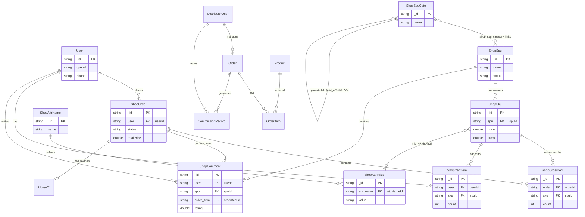

# 数据库关系与外键关联定义指南

基于当前项目的 Express.js 与 Sequelize 实现，数据库的外键关联主要通过以下三种方式定义：

## 1. 逻辑外键 (Logical Foreign Keys)
这是本项目最核心的定义方式，主要用于 `shop_` 前缀的业务表。这些关联在数据库引擎层面不一定存在 `FOREIGN KEY` 约束，而是由应用逻辑保证。

- **定义方式**：使用 `DataTypes.STRING(34)` 或 `(64)` 类型的列（通常在 Sequelize 模型中通过 `field` 映射到 `_id` 或特定字段名）。
- **关联逻辑**：通过存储关联记录的 `_id` 字符串实现。
- **示例**：
  - `shop_sku.spu` 字段存储 `shop_spu._id`。
  - `shop_order.user` 字段存储 `users._id`。
- **Sequelize 定义**：通常使用 `constraints: false` 避免 Sequelize 在同步时创建底层物理约束。

## 2. 中间关联表 (Link Tables / Junction Tables)
对于多对多（Many-to-Many）关系，项目使用了以 `mid_` 开头的中间表，这种风格常见于云开发（CloudBase）环境。

- **定义方式**：中间表包含 `_id` (主键), `leftRecordId` (左表 ID), `rightRecordId` (右表 ID)。
- **关联逻辑**：手动或通过 `shopRelationService.js` 进行维护。
- **示例**：
  - `shop_spu_category_links` (原 `mid_shop_spu_shop_spu_c_5oe72yVQ5`)：连接 `shop_spu_cate` (Category) 和 `shop_spu` (SPU)。此表已启用物理外键约束。
  - `mid_4RKieAhGh`：连接 `shop_sku` (SKU) 和 `shop_attr_value` (Attribute Value)。
  - `mid_4RKif4U2V`：连接 `shop_spu_cate` (父分类) 和 `shop_spu_cate` (子分类)，实现分类层级结构。

## 3. 严格物理外键 (Strict Foreign Keys)
在较新的模块（如 `Distributor` 分销系统）中，使用了更传统的关系数据库设计。

- **定义方式**：使用 `BIGINT.UNSIGNED` 类型的列。
- **关联逻辑**：使用 Sequelize 的标准关联方法 (`hasMany`, `belongsTo`)。
- **示例**：
  - `Order.user_id` 关联 `DistributorUser.id`。

---

## 数据库关系图 (ER Diagram)

以下是使用 Mermaid 语法生成的数据库核心关系图：

## 总结
在 Express.js 视角下，如果你需要直接操作这些表：
1. **对于 `shop_` 表**：请确保插入的 `_id` 是唯一的字符串（通常是 34 位左右），关联字段（如 `spu`, `user`）填入对应的 `_id`。
2. **对于中间表**：插入时通常需要手动维护 `leftRecordId` 和 `rightRecordId`，并生成一个 MD5 的 `_id` 以防重复（参考 `shopRelationService.js`）。
3. **查询**：直接使用 `INNER JOIN` 关联 `_id` 即可。
