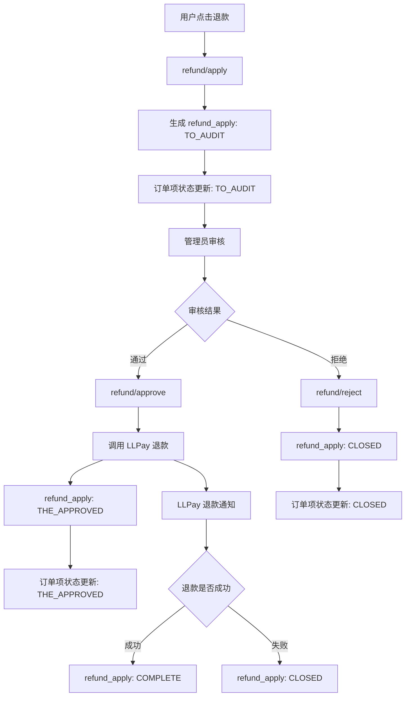

# 退款流程（含订单项状态）

## 状态映射
- 订单项状态：TO_AUDIT(10) → THE_APPROVED(20) → CLOSED(60)
- 退款单状态：TO_AUDIT(10) → THE_APPROVED(20) → COMPLETE(50) / CLOSED(60)

## 订单项更新策略
- 优先使用订单项 ID 更新
- 若未提供订单项 ID，则按 SKU 更新
- 若以上都没有，则按订单号更新全部订单项
